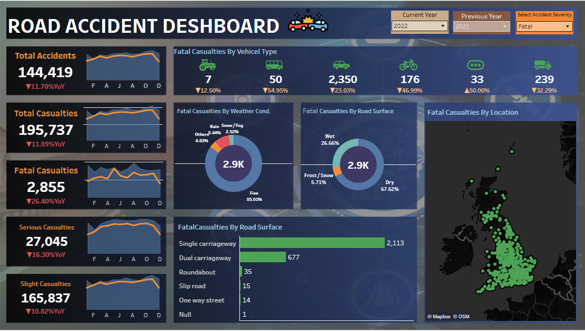

# 🚗 Road Accident Dashboard (Tableau)

## 🔗 View Live Dashboard  

👉 **[Click Here to Open the Tableau Dashboard](https://public.tableau.com/views/Project-1_16956855739470/Dashboard1?:language=en-US&:sid=&:redirect=auth&:display_count=n&:origin=viz_share_link)**   

## 🎥 Demo

Here’s a quick look at the **Road Accident Analysis Dashboard** 👇

---

## 📊 Dashboard Preview

Here’s a preview of the **Road Accident Dashboard** built in **Tableau**, offering detailed insights into accident severity, vehicle involvement, weather conditions, and road surface impact:

---

## 📝 Overview

This project features an **interactive Road Accident Dashboard** created using **Tableau**. The dashboard provides a comprehensive view of road accident patterns and casualties across various dimensions such as:

* **Accident counts and casualties**
* **Fatal, serious, and slight injury trends**
* **Vehicle Type involvement**
* **Weather & road surface conditions**
* **Location-based fatal casualty mapping**
* **Year-over-Year comparison between selected years**

Designed for **data analysts, transportation departments, policymakers, and safety researchers**, this dashboard helps identify critical areas of concern and supports data-driven decisions for road safety improvements.

---

## 📸 Dashboard Sections

### 🔶 KPI Summary Panels

* Total Accidents
* Total Casualties
* Fatal, Serious & Slight Casualty Counts
* YoY Indicators
* Trend Line Mini-Charts

### 🚘 Fatal Casualties by Vehicle Type

Breakdown of fatal casualties involving:

* Cars
* Buses
* Bikes
* Vans
* Agricultural vehicles
* Others

### 🌦 Fatal Casualties by Weather Conditions

Interactive donut chart showing contributions of:

* Fine weather
* Rain
* Snow/Fog
* Other conditions

### 🛣 Fatal Casualties by Road Surface

Breakdown of fatal accidents based on:

* Dry
* Wet
* Frost/Snow

### 🗺 Fatal Casualties by Location (Map)

Geographical view of fatal accident hotspots using Tableau's mapping capabilities.

### 📊 Fatal Casualties by Road Type

* Single carriageway
* Dual carriageway
* Roundabout
* Slip road
* One-way street
* Other

### 🔧 Filters Panel

* Select Accident Severity
* Current Year
* Previous Year

---

## 🗂 Dataset

**Source:** Public road accident datasets (government open data portals or transportation agencies)

**Data Fields Used:**

* Vehicle type
* Road surface type
* Weather conditions
* Accident severity
* Casualty counts
* Location (latitude/longitude)
* Date & Year

---

## ⚙️ Features

✔ Fully interactive Tableau dashboard
✔ Year-over-year comparison
✔ Visual drill-downs
✔ Geographic accident mapping
✔ Severity-based filtering
✔ Clear and modern UI for easy analysis

---

## 👨‍💻 Developer

**Abu Usama**
Data Analyst | BI Developer | Dashboard Specialist

    
    🌍 Connect with me:     

---

## 📝 License

This project is licensed under the **MIT License** — see the `LICENSE` file for details.

---

